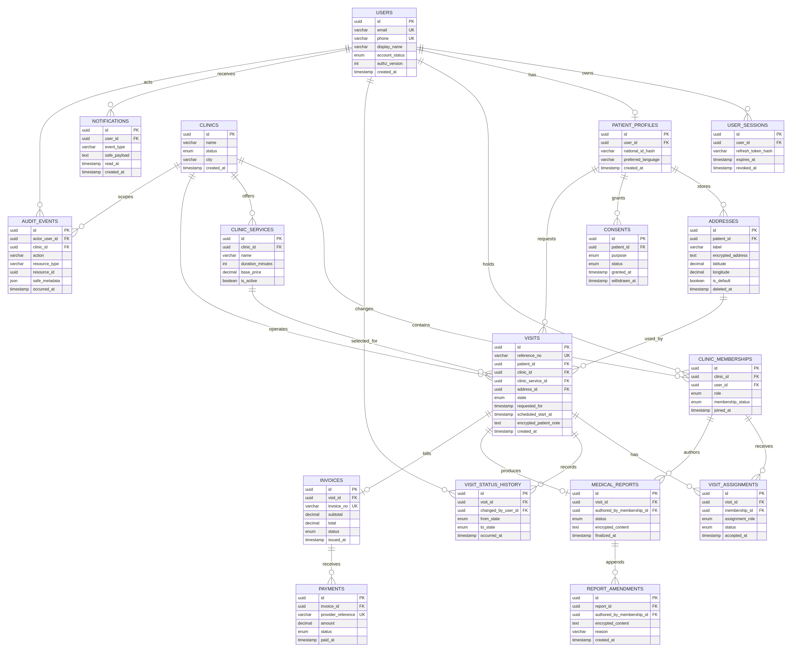

# تصميم قاعدة بيانات MediCare Pro المتوافق مع مسار المريض

**الإصدار:** 1.0  
**المرحلة:** تصميم منطقي وتنفيذي مرجعي؛ لا ينشئ هذا المستند قاعدة بيانات أو بيانات حقيقية.  
**الغرض:** ربط رحلة المريض وواجهات النظام المخططة بجداول وعلاقات وقيود وصلاحيات قابلة للتنفيذ لاحقاً.

> **قرار معماري:** النموذج المنطقي محايد لمحرك قاعدة البيانات، لكن النسخة المرجعية للأمن السريري تستخدم PostgreSQL مع Row-Level Security. يستخدم قالب الويب الحالي MySQL/TiDB؛ إذا استُخدم هذا القالب في التنفيذ، يجب نقل قواعد العزل إلى طبقة API والسياسات الموثقة، أو اعتماد PostgreSQL لخدمة البيانات الحساسة. لا يجوز الادعاء بتوافر RLS في MySQL/TiDB بالصيغة نفسها.

---

## 1. المخطط العلائقي المتوافق مع رحلة المريض

يمثل المخطط مساراً واحداً متصلاً: يبدأ بحساب `USERS`، وينتج عنه ملف مريض وعناوين وموافقات، ثم يختار المريض خدمة عيادة وينشئ زيارة. تدير الزيارة تعيينات الفريق وتاريخ حالاتها، ثم تنتهي بتقرير طبي وفاتورة ومدفوعات تجريبية، مع سجل إشعارات وتدقيق مستقلين.

| خطوة واجهة المريض | الجداول المعنية | العملية المحفوظة | قاعدة الحماية الأساسية |
|---|---|---|---|
| تسجيل الدخول | `USERS`, `USER_SESSIONS` | إنشاء/تدوير جلسة وربط Refresh Token hash | لا تخزن كلمة مرور أو Refresh Token كنص صريح. |
| اختيار الخدمة | `CLINICS`, `CLINIC_SERVICES` | قراءة خدمات فعّالة ضمن العيادة | خدمات فعالة فقط؛ لا يثق العميل في السعر أو المدة. |
| اختيار العنوان | `PATIENT_PROFILES`, `ADDRESSES` | قراءة عنوان يملكه المريض | `address.patient_id` يجب أن يطابق المريض الحالي. |
| تأكيد الحجز | `VISITS`, `VISIT_STATUS_HISTORY`, `AUDIT_EVENTS` | إنشاء زيارة `REQUESTED` داخل Transaction | Idempotency ومنع عنوان/خدمة خارج النطاق. |
| تعيين الفريق | `CLINIC_MEMBERSHIPS`, `VISIT_ASSIGNMENTS`, `VISITS` | ربط عضو مؤهل بالزيارة وتحديث الحالة | العضو ومدير العيادة يجب أن ينتميا إلى العيادة ذاتها. |
| تنفيذ الزيارة | `VISIT_STATUS_HISTORY`, `VISITS` | انتقال حالة واحد موثق | State Machine وقفل الصف لمنع السباقات. |
| التقرير | `MEDICAL_REPORTS`, `REPORT_AMENDMENTS` | حفظ تقرير مشفر وإقفاله | التقرير النهائي لا يبدّل؛ التعديل append-only. |
| الفاتورة | `INVOICES`, `PAYMENTS` | إصدار فاتورة ونتيجة دفع تجريبية | فصل كامل بين المحتوى المالي والتقرير الطبي. |
| الإشعار والتدقيق | `NOTIFICATIONS`, `AUDIT_EVENTS` | تسجيل حدث آمن وإشعار بحد أدنى | لا نص تقرير أو عنوان كامل في payload الإشعار. |

---

## 2. تقسيم الجداول حسب نطاق الأعمال

### 2.1 الهوية والجلسات والصلاحيات

| الجدول | الهدف | الحقول الجوهرية | القيود المقترحة |
|---|---|---|---|
| `users` | هوية الحساب الأساسية لكل الأدوار | `id`, `email`, `phone`, `display_name`, `account_status`, `authz_version` | `email` و`phone` فريدان عند وجودهما؛ الحساب المعطل لا ينشئ جلسة جديدة. |
| `user_sessions` | جلسات موثقة قابلة للإلغاء | `id`, `user_id`, `refresh_token_hash`, `expires_at`, `revoked_at` | لا يسمح بـRefresh من جلسة منتهية أو ملغاة؛ فهرس على `(user_id, revoked_at)`. |
| `clinic_memberships` | ربط مستخدم بدور داخل عيادة | `clinic_id`, `user_id`, `role`, `membership_status` | فريد على `(clinic_id, user_id)`؛ العضوية النشطة فقط تستطيع تنفيذ إجراءات العيادة. |

لا توضع قائمة صلاحيات طويلة داخل JWT. يحتفظ `authz_version` بنسخة تفويض المستخدم، بحيث يبطل الخادم منطقياً الرموز القديمة بعد تعطيل حساب أو تغيير عضوية. تحسم صلاحية العيادة من `clinic_memberships` وقت الطلب أو من cache آمن قصير العمر، لا من اختيار واجهة العميل.

### 2.2 ملف المريض والخصوصية

| الجدول | الهدف | الحقول الجوهرية | قواعد دورة الحياة |
|---|---|---|---|
| `patient_profiles` | ملف مريض مرتبط بحساب واحد | `id`, `user_id`, `national_id_hash`, `preferred_language` | علاقة واحد إلى واحد مع المستخدم؛ لا يعرض `national_id_hash` في API. |
| `addresses` | عناوين زيارة مملوكة للمريض | `patient_id`, `label`, `encrypted_address`, `latitude`, `longitude`, `is_default`, `deleted_at` | حذف منطقي؛ لا حذف فعلي إن كان العنوان مستخدماً في زيارة تاريخية. |
| `consents` | موافقات استخدام البيانات بحسب الغرض | `patient_id`, `purpose`, `status`, `granted_at`, `withdrawn_at` | لا تعدل الموافقة القديمة؛ ينشأ سجل حالة جديد أو يحدد `withdrawn_at`. |

يوصى بفصل العرض عن الحفظ: ترسل الواجهة إلى المستخدم تسمية مختصرة مثل «المنزل — حي تجريبي»، بينما يحتفظ حقل `encrypted_address` بالبيان الكامل بعد تشفيره في طبقة تطبيق/خدمة مفاتيح معتمدة. لا تعتمد سلامة البيانات على تمويه واجهة المستخدم فقط.

### 2.3 العيادات والخدمات والطواقم

| الجدول | الهدف | الحقول الجوهرية | القيود المقترحة |
|---|---|---|---|
| `clinics` | العيادات التي تعمل في المنصة | `id`, `name`, `status`, `city` | `status=ACTIVE` مطلوب لقبول حجوزات جديدة. |
| `clinic_services` | قائمة خدمات كل عيادة | `clinic_id`, `name`, `duration_minutes`, `base_price`, `is_active` | فهرس على `(clinic_id, is_active)`؛ السعر المرجعي يحفظ عند الفاتورة ولا يعاد حسابه من خدمة لاحقة. |
| `clinic_memberships` | الفريق ودوره ضمن العيادة | `clinic_id`, `user_id`, `role`, `membership_status` | يمكن إضافة تأهيلات منفصلة لاحقاً في `staff_qualifications` عند توسيع الخدمات. |

### 2.4 الزيارة والتعيين والحالات

| الجدول | الهدف | الحقول الجوهرية | القيود المقترحة |
|---|---|---|---|
| `visits` | المورد المركزي لمسار المريض | `reference_no`, `patient_id`, `clinic_id`, `clinic_service_id`, `address_id`, `state`, `requested_for`, `scheduled_start_at` | رقم مرجعي فريد؛ قيود FK؛ فهرس قوائم التشغيل؛ حالة افتراضية `REQUESTED`. |
| `visit_assignments` | تحديد أعضاء الفريق للزيارة | `visit_id`, `membership_id`, `assignment_role`, `status`, `accepted_at` | فهرس على `(membership_id, status)`؛ قائد نشط واحد فقط لكل زيارة باستخدام قيد/فهرس جزئي. |
| `visit_status_history` | أثر تاريخي للانتقالات | `visit_id`, `changed_by_user_id`, `from_state`, `to_state`, `occurred_at` | لا تعديل أو حذف بعد الكتابة؛ الفهرس `(visit_id, occurred_at DESC)`. |

#### حالات الزيارة المسموح بها

| الحالة | من ينشئها | الانتقالات المسموحة | ما تفعله الواجهة |
|---|---|---|---|
| `REQUESTED` | المريض عند التأكيد | `ASSIGNED`, `CANCELLED` | بطاقة تأكيد وحالة انتظار؛ زر إلغاء عند القدرة. |
| `ASSIGNED` | مدير العيادة | `CONFIRMED`, `CANCELLED` | إشعار تكليف للفريق؛ لا تظهر حالة في الطريق للمريض بعد. |
| `CONFIRMED` | العضو المكلّف عند القبول | `EN_ROUTE`, `CANCELLED` | موعد مؤكد ومعلومات تنفيذ محدودة. |
| `EN_ROUTE` | عضو مكلّف | `ARRIVED` | يظهر للمريض النص «الفريق في الطريق» لا مجرد لون. |
| `ARRIVED` | عضو مكلّف | `IN_PROGRESS` | يؤكد الوصول ويجهز بدء التنفيذ. |
| `IN_PROGRESS` | عضو مكلّف | `COMPLETED` أو معالجة استثنائية | يسمح بالمسودة الطبية حسب الدور. |
| `COMPLETED` | خدمة التقرير/العضو المخول | — | تفتح التقرير والفاتورة/التقييم عند توافرها. |
| `CANCELLED` | المريض أو المدير حسب السياسة | — | تعرض السبب المسموح وتمنع انتقالات أخرى. |

> يجب أن تنفذ دالة خادمية أو Transaction Service انتقال الحالة وتضيف صفاً في `visit_status_history` وسجل تدقيق في العملية نفسها. لا تكتب الواجهة قيمة `state` مباشرة.

### 2.5 التقرير والفاتورة والمدفوعات

| الجدول | الهدف | الحقول الجوهرية | قاعدة عدم التغيير |
|---|---|---|---|
| `medical_reports` | التقرير النهائي/المسودة للزيارة | `visit_id`, `authored_by_membership_id`, `status`, `encrypted_content`, `finalized_at` | تقرير نهائي واحد للزيارة؛ بعد `FINALIZED` لا يحدّث المحتوى الأصلي. |
| `report_amendments` | تصحيحات لاحقة قابلة للتدقيق | `report_id`, `authored_by_membership_id`, `encrypted_content`, `reason` | إضافة فقط؛ تربط بالنسخة الأصلية ولا تمحوها. |
| `invoices` | فاتورة زيارة مكتملة | `visit_id`, `invoice_no`, `subtotal`, `total`, `status`, `issued_at` | فاتورة واحدة نشطة للزيارة في MVP؛ الأرقام لا تعاد من سعر الخدمة الحالي. |
| `payments` | نتيجة دفع تجريبية أو تكامل لاحق | `invoice_id`, `provider_reference`, `amount`, `status`, `paid_at` | مرجع البوابة فريد؛ لا أرقام بطاقة أو CVV أو بيانات حساسة للوسيلة. |

### 2.6 الإشعارات والتدقيق

| الجدول | الهدف | المحتوى المقبول | المحتوى المحظور |
|---|---|---|---|
| `notifications` | صندوق وارد للمستخدم وحالة القراءة | `event_type`, مفتاح زيارة، رسالة عامة، `read_at` | نص التقرير، العنوان الكامل، رموز الجلسة، أو بيانات الدفع. |
| `audit_events` | سجل أمني وتشغيلي append-only | الفاعل، العيادة، الإجراء، نوع المورد، معرف المورد، metadata آمن | كلمة مرور، Token، عنوان كامل، محتوى تقرير طبي، أو بيانات بطاقات. |

---

## 3. العلاقات المرجعية وقواعد الاتساق

| العلاقة | الشكل | قاعدة الاتساق |
|---|---|---|
| مستخدم ↔ ملف مريض | واحد إلى صفر/واحد | لا ينشأ ملف مريض إلا لحساب فعال. |
| مريض ↔ عناوين | واحد إلى متعدد | لا يستطيع مريض استخدام عنوان مريض آخر في زيارة. |
| عيادة ↔ خدمات | واحد إلى متعدد | الخدمة المختارة للزيارة يجب أن تنتمي إلى العيادة نفسها. |
| عيادة ↔ عضويات | واحد إلى متعدد | الدور داخل العيادة، لا على مستوى منصة كامل افتراضياً. |
| مريض ↔ زيارات | واحد إلى متعدد | الزيارة تخص مريضاً واحداً ولا يتغير مالكها بلا إجراء تدقيق خاص. |
| زيارة ↔ تعيينات | واحد إلى متعدد | قائد واحد نشط؛ أعضاء مساندون حسب سياسة الخدمة. |
| زيارة ↔ تاريخ الحالات | واحد إلى متعدد | كل تغير حالة ينتج صفاً غير قابل للتعديل. |
| زيارة ↔ تقرير | واحد إلى صفر/واحد | التقرير النهائي يرتبط بزيارة مكتملة فقط. |
| زيارة ↔ فاتورة | واحد إلى صفر/واحد في MVP | الفاتورة تصدر بعد شروط العمل المحددة. |
| فاتورة ↔ مدفوعات | واحد إلى متعدد | يدعم محاولات/نتائج دفع متعددة بلا تكرار القيمة المالية. |

### 3.1 قيود يجب فرضها في قاعدة البيانات أو خدمة معاملات موثقة

| المعرّف | القيد | الموضع المناسب |
|---|---|---|
| DB-C-01 | `visits.address_id` يخص `visits.patient_id` | Trigger أو Service Transaction؛ لا يكفي FK مفرد. |
| DB-C-02 | `clinic_service.clinic_id = visit.clinic_id` | Service Transaction أو قيد مركب عند التصميم الفعلي. |
| DB-C-03 | العضو المعيّن نشط وينتمي لعيادة الزيارة | Transaction عند إضافة assignment. |
| DB-C-04 | قائد واحد نشط للزيارة | Unique partial index أو Constraint حسب المحرك. |
| DB-C-05 | انتقال حالة وفق State Machine فقط | Stored function/Service Layer مع قفل صف. |
| DB-C-06 | تقرير نهائي واحد غير قابل للتعديل | Unique index على visit للفinal + سياسة منع update. |
| DB-C-07 | الفاتورة لا تصدر قبل اكتمال الزيارة | Service rule أو Trigger محافظ. |
| DB-C-08 | لا تحديث لحدث تدقيق أو تاريخ حالة | صلاحيات DB append-only وقيود التطبيق. |
| DB-C-09 | طلب حجز مكرر لا ينشئ زيارتين | جدول `idempotency_keys` أو unique key للفعل + المستخدم + المفتاح. |

---

## 4. الفهارس وخطط الاستعلام

لا تنشأ الفهارس لكل عمود بصورة تلقائية؛ تضاف استناداً إلى مسارات واجهة الاستخدام وقياس `EXPLAIN ANALYZE` في بيئة اختبارية. توضح القائمة التالية فهارس أولية مرتبطة مباشرة بالشاشات المخططة.

| استعلام الواجهة | الفهرس الأولي | المبرر |
|---|---|---|
| الزيارة القادمة للمريض | `visits(patient_id, scheduled_start_at DESC)` مع فلتر حالات مفتوحة | بطاقة الرئيسية وقائمة «زياراتي». |
| قائمة عمليات العيادة | `visits(clinic_id, state, scheduled_start_at ASC)` | طلبات تحتاج إلى تعيين ومواعيد اليوم. |
| مهام الفريق | `visit_assignments(membership_id, status)` مع join للزيارة | شاشة «مهامي». |
| تاريخ زيارة | `visit_status_history(visit_id, occurred_at DESC)` | Timeline في تفاصيل الزيارة. |
| تقرير/فاتورة مورد | `medical_reports(visit_id)`, `invoices(visit_id)` | فتح بطاقات التقرير والفاتورة. |
| الإشعارات | `notifications(user_id, read_at, created_at DESC)` | Inbox والعداد غير المقروء. |
| تدقيق مورد | `audit_events(resource_type, resource_id, occurred_at DESC)` | مراجعة تغيرات زيارة أو تقرير. |
| تجديد جلسة | `user_sessions(user_id, revoked_at, expires_at)` | إلغاء وتحقق جلسات المستخدم. |

---

## 5. نموذج العزل والتفويض

### 5.1 مصادر الحقيقة

| السؤال الأمني | مصدر الحقيقة | لا يعتمد على |
|---|---|---|
| من هو المستخدم؟ | جلسة موثقة + `users.id` | `userId` يرسله العميل في body أو query. |
| ما دوره ضمن العيادة؟ | `clinic_memberships` النشطة | إخفاء أو إظهار زر في الواجهة. |
| هل يملك المورد؟ | `visits.patient_id`, `addresses.patient_id`, وفحوص العلاقة | معرف مورد في URL فقط. |
| هل يستطيع تغيير الحالة؟ | assignment فعال + State Machine + دور | قائمة انتقالات محلية قديمة. |
| هل يستطيع قراءة التقرير؟ | علاقة المريض أو عضو مخول + التقرير نهائي | كون التقرير ظهر في cache سابق. |

### 5.2 سياق جلسة قاعدة البيانات المرجعي لـPostgreSQL

عند كل طلب موثوق، تضبط طبقة الخادم سياقاً محدوداً داخل Transaction، مثل `app.user_id` و`app.active_clinic_id` و`app.membership_ids`. تستخدم سياسات RLS هذه القيم مع علاقة المورد. يجب ألا يمتلك مستخدم اتصال التطبيق صلاحية `BYPASSRLS` أو ملكية الجداول الحساسة.

| الجدول | سياسة قراءة مفهومية | سياسة كتابة مفهومية |
|---|---|---|
| `addresses` | المريض يقرأ صفوفه؛ مدير/فريق يقرأ العنوان عند وجود زيارة مصرح بها وحالة مناسبة | المريض يعدل عناوينه فقط، مع حذف منطقي. |
| `visits` | المريض يقرأ زياراته؛ عضو العيادة يقرأ نطاق عيادته وحسب علاقته/دوره | المريض ينشئ لنفسه؛ المدير يعيّن؛ الفريق ينتقل ضمن التكليف. |
| `medical_reports` | المريض يقرأ تقرير زيارته النهائي؛ المؤلف المصرح ضمن عيادته | عضو مخول يكتب المسودة/الإقفال؛ التعديل append-only. |
| `invoices` | المريض يقرأ فاتورة زيارته؛ المحاسب والمدير ضمن العيادة | المحاسب/المدير يصدر وفق حالة الزيارة. |
| `audit_events` | مدير محدد/مشرف ضمن نطاق واضح | إدراج خادمي فقط؛ لا update/delete من التطبيق. |

### 5.3 التشفير والبيانات الحساسة

| نوع البيانات | أسلوب الحماية | ما يراه العميل |
|---|---|---|
| كلمة المرور | Argon2id hash في نظام الهوية | لا تعاد مطلقاً. |
| Refresh Token | hash أحادي الاتجاه ومفتاح/حجم آمن | Token واحد عبر قناة آمنة، لا يعرض لاحقاً. |
| عنوان الزيارة | تشفير تطبيق/حقل + صلاحيات العلاقة | العنوان الكامل في شاشة ذات غرض مصرح فقط. |
| ملاحظة المريض | تشفير قبل التخزين | تظهر لمستخدم مخول ضمن الزيارة فقط. |
| التقرير الطبي | تشفير محتوى + تراخيص التقرير | التقرير النهائي فقط مع `Cache-Control: no-store`. |
| بيانات الدفع | مرجع مزود دفع فقط | مبلغ وحالة ورقم فاتورة، بلا بطاقة أو CVV. |

---

## 6. دورة الحياة والاحتفاظ

| المورد | الإنشاء | التعديل | الأرشفة/الحذف | الأثر |
|---|---|---|---|---|
| حساب المستخدم | عند التسجيل/الدعوة | ملف وحالة عبر عمليات مخولة | تعطيل قبل الحذف؛ وفق سياسة قانونية لاحقة | Audit للحالات الحساسة. |
| عنوان | من المريض | مالك العنوان فقط | `deleted_at` ولا يحذف إن استخدم تاريخياً | يبقى ارتباط تاريخ الزيارة متسقاً. |
| زيارة | تأكيد حجز ناجح | انتقالات صالحة فقط | إلغاء منطقي؛ لا حذف مباشر | تاريخ حالة وتدقيق. |
| تقرير | تنفيذ خدمة التقرير | المسودة ثم إقفال | تعديل منفصل بعد الإقفال | تقرير أصلي محفوظ وتعديلات قابلة للتتبع. |
| فاتورة | زيارة مؤهلة | حالة مالية مقيّدة | إلغاء/إصدار إشعار دائن بحسب سياسة مستقبلية | لا حذف تاريخ مالي. |
| إشعار | حدث أعمال أو أمن | `read_at` فقط | أرشفة/حذف حسب سياسة الاحتفاظ | لا بيانات طبية حساسة في payload. |
| تدقيق | عملية حساسة | لا تعديل | احتفاظ وفق السياسة | append-only. |

---

## 7. تسلسل الهجرات عند التنفيذ الفعلي

| الترتيب | الهجرة | سبب الترتيب |
|---:|---|---|
| 1 | الهوية: users, sessions, clinics | جداول مرجعية بلا اعتماد سريري. |
| 2 | الملفات والعناوين والموافقات | تعتمد على users/patient profile. |
| 3 | العضويات والخدمات | تعتمد على users وclinics. |
| 4 | الزيارات وتاريخ الحالة والتعيينات | تعتمد على المريض والعنوان والعيادة والخدمة والعضوية. |
| 5 | التقارير وتعديلاتها | تعتمد على الزيارة والتعيين. |
| 6 | الفواتير والمدفوعات | تعتمد على الزيارة. |
| 7 | الإشعارات والتدقيق وidempotency | يمكنها الارتباط بكل الموارد. |
| 8 | الفهارس، القيود المركبة، RLS/سياسات التطبيق | بعد الجداول والعلاقات، وبناء على استعلامات الواجهة. |

> قبل أي تطبيق فعلي: يراجع الفريق الترحيلات في بيئة Staging، وينفذ نسخة احتياطية، ويطبق التغييرات غير الهدامة أولاً، ويختبر الاستعادة. لا تستخدم بيانات مرضى حقيقية في بيئة العرض أو الاختبار.

---

## 8. اختبارات قبول قاعدة البيانات المرتبطة بالواجهات

| المعرّف | حالة الواجهة | الاختبار | النجاح المتوقع |
|---|---|---|---|
| DB-UI-01 | حجز زيارة | يحاول مريض A استخدام `addressId` لمريض B | رفض كامل ولا صف زيارة جديد. |
| DB-UI-02 | تشغيل العيادة | مدير عيادة A يفتح زيارة عيادة B | 403/404 آمن و0 صف مكشوف. |
| DB-UI-03 | تعيين الفريق | تعيين عضو من عيادة أخرى | رفض المعاملة؛ لا assignment ولا تغير حالة. |
| DB-UI-04 | Timeline | محاولة `COMPLETED` من `REQUESTED` | رفض State Machine وسجل التاريخ ثابت. |
| DB-UI-05 | التقرير | مستخدم لا يملك الزيارة يطلب التقرير | لا محتوى طبي، وتدقيق رفض عند السياسة. |
| DB-UI-06 | الحجز المتكرر | طلبان بنفس Idempotency Key | زيارة واحدة والاستجابة المرجعية ذاتها. |
| DB-UI-07 | الفاتورة | محاسب يقرأ التقرير | تمنع الصلاحية؛ تبقى الفاتورة فقط ضمن النطاق. |
| DB-UI-08 | تعديل التقرير | محاولة تعديل تقرير `FINALIZED` | رفض/إنشاء amendment فقط، لا تعديل للأصل. |
| DB-UI-09 | الأداء | قائمة العيادة عند حجم بيانات اختبار | يستخدم الفهرس المتوقع وضمن عتبة زمن p95 المعتمدة. |

---

## 9. عناصر التسليم التالية

عند اعتماد هذا التصميم، تكون الخطوة التقنية التالية هي تحويل النموذج المنطقي إلى مخطط Drizzle أو SQL خاص بالمحرك النهائي، ثم كتابة migrations واختبارات تكامل. يجب ألا يبدأ ذلك إلا بعد تقرير محرك قاعدة البيانات النهائي، لأن RLS والسياسات قد تحتاجان PostgreSQL أو طبقة تفويض بديلة موثقة في MySQL/TiDB.

**نهاية الوثيقة.**
