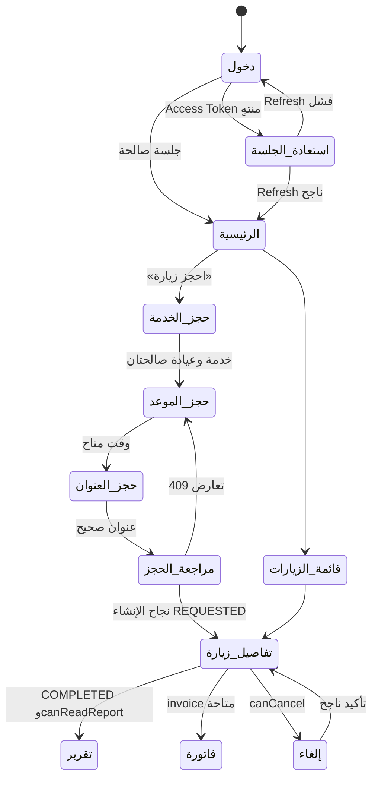

# نظام التصميم ومكتبة المكونات وخطة مسار المريض — MediCare Pro

**الإصدار:** 1.0  
**المرحلة:** مواصفات تصميم وتنفيذ لاحق؛ لا يشمل هذا المستند واجهات تشغيلية أو بيانات مرضى حقيقية.  
**المنصة المستهدفة:** Web Application عربية RTL متجاوبة؛ مع إمكان مشاركة الرموز والمكونات مع تطبيق Android لاحقاً.

> **قاعدة التصميم المركزية:** على كل شاشة أن تجيب بوضوح عن ثلاثة أسئلة: ما حالة الزيارة الآن؟ ما الإجراء التالي المسموح؟ وما البيانات التي يجب أن يراها هذا الدور فقط؟

---

## 1. مبادئ نظام التصميم

| المبدأ | قرار التصميم | الأثر على المنتج |
|---|---|---|
| الهدوء والثقة | مساحات بيضاء واسعة، تركوازي هادئ، حدود خفيفة، ورسائل قصيرة دقيقة | تجربة صحية مطمئنة بلا ازدحام أو لغة مثيرة للقلق. |
| العربية أولاً | RTL افتراضي، خط عربي واضح، وتنسيق أرقام وتواريخ محلي | تقليل العبء المعرفي على المستخدم العربي. |
| الحالة قبل الإجراء | تعرض كل بطاقة زيارة حالة نصية وخطوة تالية | فهم أسرع لمسار الزيارة ومنع التخمين. |
| أقل صلاحية مرئية | تعرض الشاشة المعلومة والفعل المناسبين للدور فقط | دعم RBAC في تجربة الاستخدام وتقليل الإفصاح غير المقصود. |
| الأخطاء قابلة للاسترداد | تحافظ النماذج على الإدخال الصحيح وتشرح ما يلزم تعديله | تقليل التخلي عن الحجز أو التعيين. |
| الوصول جزء من المكون | تسمية، تركيز، تباين، وحالة قارئ شاشة ضمن تعريف المكوّن | لا يؤجل الوصول إلى مرحلة فحص متأخرة. |

---

## 2. الرموز البصرية (Design Tokens)

### 2.1 اللون

لا تستخدم الألوان بوصفها معلومة وحيدة؛ كل لون حالة يرافقه نص ورمز عند الحاجة. يفضل حفظ الرموز الدلالية لا قيم الألوان المباشرة داخل المكونات، كي يمكن تغيير العلامة البصرية لاحقاً بلا إعادة بناء للشاشات.

| فئة الرمز | الرمز | القيمة المقترحة | الاستخدام |
|---|---|---|---|
| الخلفية | `--color-canvas` | `#F7FAF8` | خلفية التطبيق العامة. |
| السطح | `--color-surface` | `#FFFFFF` | البطاقات والقوائم والنوافذ. |
| السطح الهادئ | `--color-surface-subtle` | `#EEF7F4` | مناطق ملخص الحالة والاختيارات النشطة. |
| النص الأساسي | `--color-text` | `#16221F` | العناوين والمحتوى الرئيس. |
| النص الثانوي | `--color-text-muted` | `#5D6C66` | الوصف والبيانات المساعدة. |
| الحد | `--color-border` | `#D8E2DE` | حدود الحقول والبطاقات. |
| الإجراء الأساسي | `--color-primary` | `#0B776B` | أزرار الحجز والقبول والتعيين. |
| hover للإجراء | `--color-primary-hover` | `#075C54` | تفاعل الماوس/اللمس. |
| نجاح | `--color-success` | `#177A45` | مكتملة، تأكيد ناجح، حفظ ناجح. |
| تحذير | `--color-warning` | `#A86B00` | يتطلب مراجعة أو انتظار. |
| خطأ | `--color-danger` | `#B42318` | فشل تحقق أو إجراء غير متاح. |
| معلومات | `--color-info` | `#1466A0` | تنبيه معلوماتي أو حالة في الطريق. |

```css
:root {
  --color-canvas: #f7faf8;
  --color-surface: #ffffff;
  --color-surface-subtle: #eef7f4;
  --color-text: #16221f;
  --color-text-muted: #5d6c66;
  --color-border: #d8e2de;
  --color-primary: #0b776b;
  --color-primary-hover: #075c54;
  --color-success: #177a45;
  --color-warning: #a86b00;
  --color-danger: #b42318;
  --color-info: #1466a0;
}
```

### 2.2 الطباعة

يوصى بخط **IBM Plex Sans Arabic** للواجهة أو **Noto Sans Arabic** عندما تكون الأولوية لتوافر الخط. يحافظ التصميم على سطر واحد للعناوين القصيرة، لكنه لا يقطع النص العربي الطويل؛ بل يلفّه ضمن ارتفاع متوقع أو يتيح عرضه كاملاً عند الحاجة.

| الرمز | القياس / وزن الخط | ارتفاع السطر | الاستخدام |
|---|---|---|---|
| `display` | 32px / 700 | 1.30 | عنوان صفحة رئيسية أو حالة فارقة. |
| `h1` | 26px / 700 | 1.35 | عنوان الصفحة. |
| `h2` | 20px / 700 | 1.40 | عنوان قسم أو بطاقة. |
| `h3` | 16px / 600 | 1.45 | عنوان عنصر فرعي. |
| `body` | 15–16px / 400 | 1.65 | النص الاعتيادي. |
| `body-small` | 13–14px / 400 | 1.55 | وصف الحقول والمعلومات المساعدة. |
| `label` | 13px / 600 | 1.40 | تسمية حقل أو Badge. |
| `numeric` | 14–16px / 600 | 1.40 | رقم زيارة، مبلغ، وقت، مؤشر. |

### 2.3 المسافات، الأبعاد، والسطح

| مجال الرمز | القيم المعتمدة | القرار |
|---|---|---|
| شبكة المسافة | 4، 8، 12، 16، 20، 24، 32، 40، 48، 64 px | لا تستخدم قيماً عشوائية بين هذه الدرجات إلا لحاجة بصرية مبررة. |
| نصف القطر | 8، 12، 16، 24 px | 8 للحقول وBadges، 12 للبطاقات، 16 للنوافذ الرئيسية. |
| ارتفاع التحكم | 36، 44، 48، 56 px | 44px حد عملي للتحكم، و48px للأفعال الرئيسة على اللمس. |
| الظل | `sm` و`md` فقط | ظل ناعم للارتفاع؛ لا تستخدم ظلالاً كثيفة أو متعددة. |
| الحدود | 1px و2px لحالة التركيز | 2px لحلقة التركيز فقط، بلون قابل للتباين. |

### 2.4 الحركة والتغذية الراجعة

تستخدم الحركة لتأكيد التغيير لا للزخرفة. زمن ضغط الزر بين 120–160ms، دخول Toast أو Popover بين 160–220ms، وفتح Dialog بين 200–280ms. تعتمد الواجهات `prefers-reduced-motion` بحيث تتحول الحركة إلى انتقالات فورية أو منخفضة الحركة.

| الحدث | السلوك المقترح |
|---|---|
| ضغط زر | تصغير طفيف `scale(0.98)` ثم عودة سريعة. |
| حفظ/إرسال | زر بعرض ثابت يتحول إلى حالة تحميل مع إبقاء التسمية مفهومة. |
| نجاح | Toast قصير مع رابط «عرض الزيارة» عند وجود مورد جديد. |
| خطأ | رسالة داخل السياق، ولا تستخدم Toast وحده لأخطاء الحقول. |
| انتقال حالة | تحديث Badge وTimeline مع حركة opacity خفيفة فقط. |

---

## 3. التخطيط المتجاوب وRTL

| الحجم | نقطتا التحول | قواعد التطبيق |
|---|---|---|
| هاتف | أقل من 768px | عمود واحد، شريط سفلي للمريض، بطاقات بدلاً من الجداول، CTA مثبت أسفل النموذج عند الحاجة. |
| لوحي | 768–1023px | عمودان مرنان، Sidebar قابل للطي، Summary فوق محتوى الحجز أو بجانبه حسب العرض. |
| سطح مكتب | 1024–1439px | شبكة 12 عموداً، Sidebar للوحة التشغيل، جدول بتمرير مضبوط عند الحاجة. |
| شاشة عريضة | 1440px فأكثر | أقصى عرض محتوى 1280–1440px، وتباعد أكبر دون توسيع النص بلا حد. |

تعتمد الأيقونات ذات الاتجاه المكاني على معنى RTL: سهم الرجوع يتجه لليمين داخل الواجهة العربية، بينما علامات الموافقة والحالة تبقى محايدة الاتجاه. تستخدم الأرقام في رقم الزيارة والمبلغ والوقت بشكل يسهل نسخه وقراءته، ولا يغير ترتيبها بنية RTL معنى القيمة.

---

## 4. مكتبة المكونات

### 4.1 بنية المجلدات المقترحة للتنفيذ اللاحق

```text
client/src/
  components/
    design-system/
      Button.tsx
      Field.tsx
      StatusBadge.tsx
      Card.tsx
      EmptyState.tsx
      Feedback.tsx
      VisitTimeline.tsx
      Stepper.tsx
    patient/
      PatientShell.tsx
      BookingFlow.tsx
      VisitSummary.tsx
      ReportCard.tsx
      InvoiceCard.tsx
  design-tokens/
    colors.css
    typography.css
    spacing.css
    motion.css
```

### 4.2 مكونات الأساس

| المكوّن | المتغيرات | الحالات الإلزامية | ملاحظة وصول |
|---|---|---|---|
| `AppShell` | مريض، تشغيل عيادة، توثيق | سطح مكتب، لوحي، هاتف | يضع `dir="rtl"` وLandmarks واضحة. |
| `PageHeader` | عنوان فقط، عنوان مع إجراء، عنوان مع Breadcrumb | طبيعي، مضغوط | عنوان واحد `h1` لكل صفحة. |
| `Card` | افتراضي، ملخص، قابل للنقر، تحذير | hover عند النقر، loading، disabled | لا تجعل البطاقة قابلة للنقر من دون دور/اسم رابط واضح. |
| `Button` | primary، secondary، outline، ghost، danger | default، hover، focus، loading، disabled | اسم فعل واضح؛ لا تعتمد على أيقونة بلا تسمية. |
| `IconButton` | مساعدة، رجوع، إغلاق، إشعار | focus، disabled | `aria-label` إلزامي وحجم لمس مناسب. |
| `StatusBadge` | requested، confirmed، en-route، arrived، in-progress، completed، cancelled | ثابت | يضم نص الحالة ورمزاً اختيارياً؛ لا لون فقط. |
| `Divider` | أفقي، عمودي | — | زخرفي ويخفى عن قارئ الشاشة إن لم ينقل معنى. |
| `Skeleton` | نص، بطاقة، جدول، خريطة | loading | لا يظهر طويلاً؛ يعقبه نجاح أو خطأ أو حالة فارغة. |

### 4.3 مكونات النماذج والاختيار

| المكوّن | الاستخدام | قواعد التفاعل | بيانات/صلاحيات |
|---|---|---|---|
| `TextField` | الاسم، الملاحظة، البحث | Label ظاهر، hint، error بجوار الحقل، حفظ الإدخال الصحيح | لا يسجل الملاحظة الحساسة في console أو analytics. |
| `SelectField` | العيادة، الخدمة، التخصص | بحث عند القوائم الكبيرة، حالة فارغة، اختيار واضح | تعرض خدمات أو أعضاء مرشحين فقط من الخادم. |
| `DateTimeSlotPicker` | فترة الزيارة | يعطل غير المتاح، يعيد التحقق عند التأكيد | لا يؤكد الموعد محلياً دون استجابة API. |
| `AddressSelector` | عنوان الزيارة | اختيار عنوان محفوظ أو إضافة، معاينة مختصرة | لا يظهر عنواناً لا يخص المستخدم. |
| `RadioGroup` | أولوية أو سبب إلغاء | خيار واحد مع وصف قصير | مجموعة معنونة ومتصلة بتعليماتها. |
| `Textarea` | ملاحظة حجز/سبب رفض | عداد أحرف وحد آمن ورسالة تحقق | يوضح أن الملاحظة ليست قناة طوارئ. |
| `FormActions` | متابعة، رجوع، إرسال | يمنع النقر المكرر ويعرض loading | يعيد التركيز لأول خطأ عند الإرسال. |

### 4.4 مكونات مسار الزيارة

| المكوّن | المدخلات الدنيا | ما يعرضه | قواعد العمل المرئية |
|---|---|---|---|
| `VisitSummaryCard` | رقم، خدمة، موعد، حالة | ملخص قابل للمسح البصري | لا يعرض التقرير أو العنوان التفصيلي في قائمة عامة. |
| `VisitTimeline` | `state`، تاريخ الحالات، القدرة | الحالة الحالية والسابق واللاحق | يعطل أو يخفي الانتقالات غير المسموح بها. |
| `VisitMapPreview` | مستوى صلاحية موقع، حالة زيارة | خريطة أو Placeholder آمن | لا تظهر قبل الحالة التي تسمح بالتتبع؛ بديل نصي للموقع. |
| `TeamAssignmentPanel` | زيارة، أعضاء مؤهلون | تعيين/إلغاء تعيين ومؤهلات | زر التعيين يراه المدير فقط. |
| `ReportCard` | حالة تقرير، صلاحية عرض | مقفلة/متاحة/تحتاج مراجعة | لا يظهر المحتوى قبل التقرير النهائي والصلاحية. |
| `InvoiceCard` | رقم، مبلغ، حالة دفع | ملخص فاتورة، إجراء عرض | لا يحتوي معلومات وسيلة دفع حساسة. |
| `RatingPrompt` | حالة زيارة مكتملة وتقييم سابق | تقييم واحد بعد الإتمام | لا يظهر قبل `COMPLETED` ولا يكرر التقييم. |

### 4.5 مكونات التغذية الراجعة والأمان

| المكوّن | متى يستخدم | النص والسلوك |
|---|---|---|
| `InlineError` | خطأ حقل أو قاعدة أعمال | يشرح المطلوب تصحيحه، مثل «اختر وقتاً متاحاً». |
| `ErrorState` | فشل تحميل صفحة أو قائمة | يوضح أن البيانات لم تحمل ويقدم «إعادة المحاولة». |
| `PermissionState` | 403/404 آمن | «لا يمكنك الوصول إلى هذه الصفحة» بلا كشف اسم المورد. |
| `SessionExpiredDialog` | فشل refresh | يشرح انتهاء الجلسة ويقود إلى الدخول؛ يمسح الحالة الخاصة. |
| `ConfirmDialog` | إلغاء زيارة/إجراء حساس | يعرض الأثر وزر تأكيد وزر رجوع واضحين. |
| `Toast` | نجاح أو تحديث محدود | رسالة قصيرة، رابط اختياري، ولا يستخدم لإخفاء خطأ حرج. |
| `SecurityContextPill` | لوحة مدير/فريق | يوضح السياق النشط، مثل «عيادة الحياة — مدير». |

### 4.6 عقود المكونات المفاهيمية

```ts
type VisitState =
  | "REQUESTED"
  | "ASSIGNED"
  | "CONFIRMED"
  | "EN_ROUTE"
  | "ARRIVED"
  | "IN_PROGRESS"
  | "COMPLETED"
  | "CANCELLED";

type StatusBadgeProps = {
  state: VisitState;
  label: string;
  description?: string;
};

type StepperProps = {
  steps: Array<{ id: string; label: string; status: "complete" | "current" | "upcoming" }>;
  currentStep: string;
};

type PermissionStateProps = {
  code: "UNAUTHENTICATED" | "FORBIDDEN" | "NOT_FOUND";
  onSignIn?: () => void;
  onBack?: () => void;
};
```

---

## 5. قواعد الحالة والتفويض في الواجهة

لا تتخذ الواجهة قراراً أمنياً نهائياً؛ بل تستخدم `capabilities` القادمة من الخادم لتحديد ما تعرضه، ويظل التحقق الخادمي وRLS مصدر الحماية النهائي. يوضح التصميم السبب عندما يكون ذلك آمناً، لكنه لا يكشف وجود مورد محمي لمستخدم غير مخول.

| القدرة القادمة من الخادم | الأثر في الواجهة | مثال |
|---|---|---|
| `canCancel` | إظهار/تعطيل زر الإلغاء مع سبب | المريض يلغي زيارة `REQUESTED` أو `CONFIRMED` وفق السياسة. |
| `canAssign` | إظهار لوحة التعيين | مدير عيادة فقط ضمن عيادته. |
| `allowedTransitions` | إظهار انتقالات محددة في Timeline | الفريق لا يرى «مكتملة» قبل «بدء التنفيذ». |
| `canReadReport` | تفعيل بطاقة التقرير | المريض يراه بعد الإقفال؛ المحاسب لا يراه. |
| `canIssueInvoice` | إظهار إنشاء الفاتورة | محاسب/مدير للزيارة المكتملة فقط. |
| `canTrackLocation` | إظهار خريطة/موقع | المريض أو مدير العيادة ضمن حالة وسياسة مناسبة. |

---

## 6. خطة تنفيذية لتطوير مسار المريض

### 6.1 ترتيب التنفيذ

| الخطوة | العمل التفصيلي | ناتج قابل للتحقق |
|---:|---|---|
| 0 | اعتماد هذا المستند، ربط كل شاشة بمتطلب ووثيقة API، وحسم حالات MVP | مصفوفة شاشة–API–دور–حالة معتمدة. |
| 1 | إنشاء ملفات Design Tokens وإعداد RTL والخط والنظام المتجاوب | صفحة تجريبية تعرض الألوان والطباعة والمسافات وحلقة التركيز. |
| 2 | بناء مكونات الأساس: AppShell، PageHeader، Button، Card، Field، Toast، EmptyState | Story/صفحة عرض لكل مكوّن وحالاته. |
| 3 | بناء Shell المريض والتنقل: الرئيسية، زياراتي، التقارير، الفواتير، الإشعارات | تنقل متجاوب يعمل ببيانات Mock آمنة. |
| 4 | تنفيذ القراءة: قائمة الزيارات وبطاقة الزيارة القادمة وتفاصيل زيارة | `GET` محمي، حالات loading/empty/error/forbidden. |
| 5 | تنفيذ حجز خطوة بخطوة: الخدمة، الموعد، العنوان، المراجعة | حالة نموذج محلية صحيحة وتحقق في كل خطوة. |
| 6 | ربط تأكيد الحجز: `POST /patient/visits` وIdempotency Key | إنشاء واحد فقط، Confirmation مع رقم مرجعي. |
| 7 | تنفيذ Timeline وحالة الزيارة والتحديث بعد إشعار/إعادة جلب | الحالة من الخادم، لا افتراضات محلية دائمة. |
| 8 | تنفيذ التقرير والفاتورة والتقييم | تقرير مقفل/متاح، فصل المحتوى الطبي عن المالي. |
| 9 | إضافة حالات انتهاء الجلسة والصلاحية والتعارض والشبكة | 401/403/404/409/422 وتجربة استرداد مفهومة. |
| 10 | اختبارات UI وE2E وRTL والوصول وUX | تغطية مسارات P0 ونتائج قبول موثقة. |

### 6.2 خطة التنفيذ التفصيلية، خطوة بخطوة

#### الخطوة 0: تثبيت العقود والمحتوى التجريبي

ينشئ الفريق ملفاً مركزياً يتضمن `VisitState` و`UserCapability` وDTO مختصراً للزيارة. يجب أن تخلو البيانات التجريبية من أسماء أو عناوين أو تقارير حقيقية. تستخدم أمثلة مثل «مريض #2048» و«حي تجريبي» بدلاً من PII. يعتمد الفريق mapping محدداً بين الشاشات والـendpoints قبل إنشاء أي مكوّن.

| الشاشة | القراءة أو الكتابة | الحد الأدنى من DTO |
|---|---|---|
| الرئيسية | `GET /patient/visits?limit=3` | رقم، خدمة، موعد، حالة، `capabilities`. |
| الحجز | `GET /specialties`, `/clinics`, `/availability`, `/patient/addresses` | خيارات مفعلة وفترات وعناوين تخص المستخدم. |
| تأكيد الحجز | `POST /patient/visits` | `clinicId`, `clinicServiceId`, `addressId`, `requestedFor`. |
| تفاصيل الزيارة | `GET /patient/visits/{id}` | حالة، Timeline، موعد، عنوان مموه، قدرات. |
| التقرير | `GET /patient/visits/{id}/report` | الحالة، التقرير النهائي عند السماح فقط. |
| الفاتورة | `GET /patient/visits/{id}/invoice` | رقم، بنود، مجموع، حالة دفع. |

#### الخطوة 1: طبقة التصميم والـApp Shell

يطبق المطور CSS variables للرموز السابقة، ويجعل `dir="rtl"` خاصية عند جذر التطبيق. يبنى Shell المريض أولاً، مع Header سطح مكتب وBottom Navigation للهاتف. تضاف صفحة معزولة لعرض المكونات، حتى يراجع المصمم والمطور الأزرار والحقول وBadges قبل نسخها داخل الصفحات.

#### الخطوة 2: الرئيسية والبيانات المقروءة

تبدأ الواجهة ببطاقة «احجز زيارة» وبطاقة الزيارة القادمة وقائمة مختصرة. يكتب المطور حالات `loading`, `empty`, `error`, `unauthorized` قبل ربط البيانات الحقيقية. عند ظهور الزيارة، يمرر الخادم قيمة الحالة ووصفها وقدراتها؛ لا تحول الواجهة الحالة إلى `confirmed` من تلقاء نفسها.

#### الخطوة 3: الحجز متعدد الخطوات

يحفظ `BookingDraft` في state محلي مع خطوة حالية، ويعيد استخدام الحقول المشتركة. تمنع كل خطوة الانتقال عند نقص البيانات المطلوبة. عند اختيار الموعد، تعيد الواجهة التحقق في خطوة المراجعة. في زر التأكيد فقط، ينشئ العميل `Idempotency-Key` ويعطل الزر حتى تستقر الاستجابة. نجاح الإنشاء يحول المستخدم إلى تفاصيل الزيارة، أما التعارض فيعيده إلى اختيار الموعد مع نص يشرح الإجراء.

#### الخطوة 4: تفاصيل الزيارة والمسار الزمني

تعرض الصفحة `VisitSummaryCard` ثم `VisitTimeline`، مع إجراءات مبنية على `capabilities`. تضع الواجهة التقرير ضمن بطاقة مقفلة إذا لم يكن نهائياً، وتظهر الفاتورة بحسب حالة الإصدار. وعند الانتقال إلى الشاشة من إشعار، تعيد جلب المورد أولاً؛ فلا تستخدم محتوى الإشعار بوصفه مصدراً للحالة أو البيانات.

#### الخطوة 5: التقرير والفاتورة والتقييم

يفصل التنفيذ بين `ReportCard` و`InvoiceCard`. لا تجلب الواجهة التقرير إلا عند فتحه ومع وجود `canReadReport`. تضبط استجابة التقرير برأس عدم التخزين على مستوى الخادم، وتمنع الواجهة نسخه تلقائياً إلى store عام أو local storage. يفتح التقييم مرة واحدة بعد الزيارة المكتملة.

#### الخطوة 6: الاختبارات والقبول

تكتب اختبارات مكونات للحالات، واختبارات E2E لمسار: تسجيل دخول تجريبي → حجز → نتيجة مرجعية → فتح تفاصيل → ظهور تقرير/فاتورة عند الحالة المناسبة. يختبر الفريق RTL والتكبير ولوحة المفاتيح وحالات 401/403/409/422، ثم يجري اختبار مهمة مع مستخدمين تجريبيين وفق خطة UI/UX السابقة.

---

## 7. رحلة المريض التفصيلية

### 7.1 خريطة الرحلة



### 7.2 مرحلة الدخول واستعادة الجلسة

| العنصر | التفصيل |
|---|---|
| هدف المريض | دخول موثوق والوصول إلى حسابه فقط. |
| الشاشة | حقلا هوية وكلمة مرور، زر «تسجيل الدخول»، رابط استعادة كلمة المرور عند تطبيقه، ورسالة خصوصية موجزة. |
| التفاعل الدقيق | يكتب المستخدم البيانات، ثم يضغط الإرسال. يتحول الزر إلى تحميل ويمنع التكرار. يستخدم التنقل بلوحة المفاتيح ترتيباً منطقياً من الهوية إلى كلمة المرور إلى الإرسال. |
| رد النجاح | تخزن الجلسة عبر آلية آمنة ثم يفتح النظام «الرئيسية» وفق السياق. لا يعرض JWT أو معلومات تقنية. |
| رد الخطأ | رسالة عامة: «تعذر تسجيل الدخول. تحقق من البيانات وحاول مجدداً.» لا تؤكد وجود الحساب. |
| حماية الواجهة | لا تحفظ كلمة المرور في state دائم أو log؛ تمسح شاشة الدخول المدخل الحساس عند الخروج أو الخطأ الأمني المناسب. |

### 7.3 الرئيسية

| العنصر | التفصيل |
|---|---|
| هدف المريض | معرفة ما يحتاجه الآن: حجز جديد أو متابعة زيارة. |
| البيانات عند الفتح | اسم ظاهر، الزيارة القادمة أو حالة فارغة، عدد الإشعارات غير المقروءة، وملخص التقارير/الفواتير غير الحساسة. |
| التفاعل الدقيق | يختار «احجز زيارة»، أو ينقر بطاقة الزيارة القادمة، أو يستخدم شريط التنقل: الرئيسية، زياراتي، التقارير، الفواتير، الإشعارات. |
| حالة فارغة | «لا توجد زيارات قادمة» مع زر حجز واضح، من دون استخدام Empty State زخرفي بلا هدف. |
| خطأ تحميل | بطاقة رسالة مع «إعادة المحاولة»؛ لا تظهر بيانات قديمة بوصفها محدثة. |
| حماية الواجهة | لا تضع عنوان الزيارة الكامل أو التقرير في قائمة الرئيسية؛ تعرض حالة وموعداً مختصراً فقط. |

### 7.4 الحجز — الخطوة الأولى: الخدمة والعيادة

| العنصر | التفصيل |
|---|---|
| نية المستخدم | تحديد الخدمة الصحية المناسبة والجهة المقدمة لها. |
| عناصر الشاشة | Stepper من أربع مراحل، Select للتخصص، Select للخدمة، Select للعيادة، وإجراء «متابعة». |
| التفاعل الدقيق | يفتح المستخدم التخصص ثم يرى خدمات متوافقة؛ عند تغيير التخصص تمسح الخدمة والموعد غير المتوافقين. ثم يختار الخدمة والعيادة. |
| التحقق | لا يصبح «متابعة» فعالاً قبل اختيار القيم الثلاث. يشرح الخطأ بجوار الحقل، لا في Toast عابر فقط. |
| حالة التحميل | Skeleton في القوائم ثم عناصر قابلة للبحث عندما يزيد العدد. |
| حماية الواجهة | القوائم معروضة من API ولا تقبل الواجهة تمرير `clinicId` غير مصرح به بوصفه حقيقة. |

### 7.5 الحجز — الخطوة الثانية: الموعد

| العنصر | التفصيل |
|---|---|
| نية المستخدم | اختيار فترة مناسبة ومتاحه. |
| عناصر الشاشة | عنوان الخدمة المحددة، منتقي تاريخ، شبكة فترات، ملخص صغير، أزرار رجوع/متابعة. |
| التفاعل الدقيق | يختار المستخدم تاريخاً ثم فترة. تميّز الفترات غير المتاحة وتمنع اختيارها. عند الرجوع تبقى الخدمة المحددة. |
| حالة التعارض | إذا لم تعد الفترة متاحة عند التأكيد النهائي، تظهر رسالة: «لم يعد هذا الوقت متاحاً. اختر وقتاً آخر.» وتعيد الواجهة جلب الخيارات. |
| حماية الواجهة | لا تعد الفترة حجزاً مؤكداً حتى إنشاء الزيارة بنجاح؛ لا تضلل المستخدم بشارة تأكيد مبكرة. |

### 7.6 الحجز — الخطوة الثالثة: العنوان

| العنصر | التفصيل |
|---|---|
| نية المستخدم | اختيار مكان الزيارة من عناوين حسابه. |
| عناصر الشاشة | قائمة عناوين ببطاقات، اختيار افتراضي، زر «إضافة عنوان» عند تفعيل الميزة، وموقع مختصر/خريطة غير تفاعلية في التخطيط. |
| التفاعل الدقيق | يختار بطاقة عنوان واحدة؛ يظهر حد تركوازي وعلامة اختيار ونص «العنوان المختار». |
| التحقق | لا يمكن المتابعة بلا عنوان صالح. عند فشل القراءة تعرض الواجهة إعادة محاولة ولا تسمح بكتابة معرف عنوان يدوياً. |
| حماية الواجهة | يعرض العنوان الكامل داخل هذه الخطوة فقط عند حاجة الحجز؛ لا يستخدم في الإشعارات أو الملخصات العامة. |

### 7.7 الحجز — الخطوة الرابعة: المراجعة والتأكيد

| العنصر | التفصيل |
|---|---|
| نية المستخدم | مراجعة الاختيارات وإرسال طلب واحد موثوق. |
| عناصر الشاشة | ملخص الخدمة والعيادة والوقت والعنوان الموجز، حقل ملاحظة محدود، تأكيد سياسة مناسبة، وزر «تأكيد الحجز». |
| التفاعل الدقيق | يستطيع المستخدم الرجوع لتعديل جزء محدد. عند الإرسال، يتحول الزر إلى «جارٍ إنشاء الزيارة…»، يتعطل، ويظهر مؤشر تقدم. |
| نجاح | شاشة/Toast تأكيد برقم مرجعي وحالة `REQUESTED` وزر «عرض تفاصيل الزيارة». |
| خطأ 422 | تبقى البيانات محفوظة؛ تظهر الرسالة قرب القسم المعني. |
| خطأ 409 | تعرض فترة بديلة أو زر «اختيار وقت آخر» وتعود للخطوة الثانية. |
| حماية الواجهة | تستخدم العملية Idempotency Key؛ لا تعرض تفاصيل SQL أو معلومات داخليّة عند الخطأ. |

### 7.8 تفاصيل الزيارة

| العنصر | التفصيل |
|---|---|
| نية المستخدم | فهم وضع الزيارة الحالي والإجراء المتاح. |
| عناصر الشاشة | Badge حالة، رقم مرجعي، بطاقة موعد، Timeline، مقدم رعاية عند إتاحته، خريطة محدودة، وبطاقات التقرير والفاتورة. |
| التفاعل الدقيق | يقرأ المستخدم الحالة، يوسع الخط الزمني، ويفتح التقرير/الفاتورة إذا كانت متاحة. يظهر زر الإلغاء فقط حين `canCancel=true`. |
| حالات العرض | `REQUESTED`: قيد مراجعة العيادة؛ `CONFIRMED`: الموعد مؤكد؛ `EN_ROUTE`: الفريق في الطريق؛ `COMPLETED`: تقرير وفاتورة متاحان وفق الحالة. |
| تحديث البيانات | عند فتح Deep Link أو إشعار، يعيد التطبيق جلب الزيارة قبل العرض. يمكن استخدام زر «تحديث الحالة» اليدوي في التخطيط. |
| حماية الواجهة | عند 403/404 تعرض صفحة وصول عامة. لا تكشف شاشة الخطأ اسم المريض أو العنوان أو وجود الزيارة. |

### 7.9 التقرير والفاتورة والتقييم

| الشاشة | التفاعل الدقيق | شرط الإتاحة | حماية الخصوصية |
|---|---|---|---|
| التقرير الطبي | يضغط «عرض التقرير»، ثم تحمل الواجهة التقرير النهائي ومعلوماته المنظمة | `COMPLETED` و`canReadReport` | لا يسبق المحتوى المقفل؛ لا يخزن في state عام أو local storage. |
| الفاتورة | يفتح المستخدم بطاقة الفاتورة ويقرأ البند والمجموع وحالة الدفع | فاتورة صادرة لصاحب الزيارة | لا تعرض أي بيانات بطاقة أو محتوى التقرير السريري. |
| التقييم | يظهر Prompt بسيط بعد الإتمام، يختار المستخدم تقييماً ويرسله مرة واحدة | زيارة مكتملة ولم يقيّمها المستخدم سابقاً | لا تعرض تقييماً مزيفاً أو شهادات مختلقة. |

### 7.10 الإشعارات والعودة إلى المسار

تصمم الإشعارات على أنها نقطة دخول لا مصدر معلومات سريرية. صياغة آمنة مثل «يوجد تحديث على إحدى زياراتك» تكفي. عند الضغط، يطلب التطبيق تفاصيل الزيارة من API، ثم يعرضها إن ظل المستخدم مخولاً. إن انتهت الجلسة، يعالج التطبيق الاستعادة أولاً ثم يعود للوجهة إن نجحت.

---

## 8. Definition of Done لمسار المريض

| المجال | شرط الإنجاز |
|---|---|
| التصميم | الرموز والمكونات منشورة في صفحة عرض، وWireframes مرتبطة بكل شاشة. |
| الوظيفة | الحجز ومنع التكرار وتفاصيل الزيارة والتقرير والفاتورة موصولة بعقود API صحيحة. |
| الصلاحيات | اختبارات تثبت منع زيارة/تقرير مريض آخر وغياب أفعال غير مخولة. |
| التجربة | حالات loading/empty/error/success موثقة ومطبقة، والرسائل العربية قابلة للفهم. |
| الوصول | تنقل لوحة مفاتيح، تسميات قارئ شاشة، خطأ حقول، تركيز، RTL، وتكبير نص. |
| الاختبار | نجاح حالات P0 في خطة UI/UX، وجولة UX مع ملاحظات وإصلاحات حرجة. |
| السلامة | بيانات تجريبية فقط، ولا Logs أو screenshots أو analytics تحتوي على PII أو محتوى تقرير طبي حقيقي. |

**نهاية المستند.**
