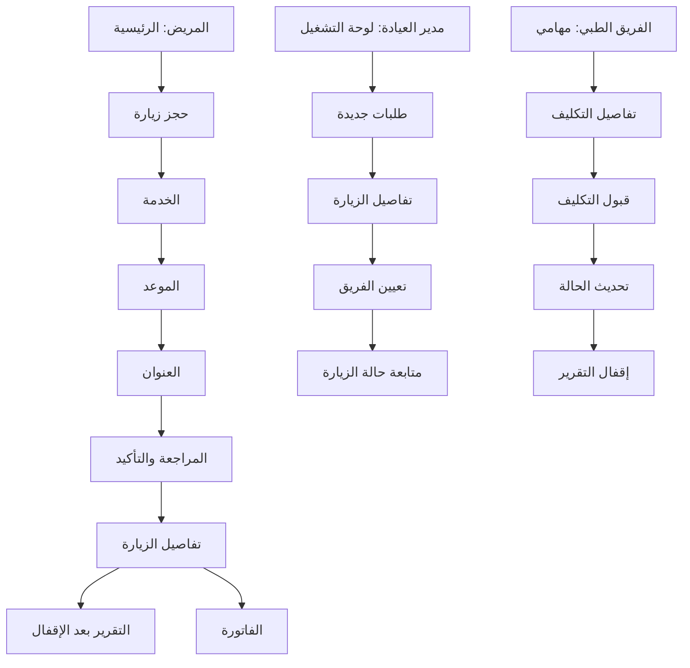

# تخطيط واجهات الويب العربية لنظام MediCare Pro

**المرحلة الحالية:** تصميم وتخطيط واجهات فقط؛ لا يتضمن هذا المستند تنفيذ React أو قاعدة بيانات أو تسجيل دخول فعلي.  
**نطاق التصميم:** تجربة مريض متكاملة، ولوحة مدير العيادة، وواجهة الفريق الطبي، ومركز وثائق وتدفق بيانات.

> يعتمد المقترح على **واجهة عربية RTL متجاوبة**. تدعم الشاشات القرارات الآمنة عبر إظهار أقل بيانات لازمة لكل دور، وإبراز حالة الزيارة كتابةً وبصرياً، وربط كل إجراء بحدود RBAC وJWT وRLS في التصميم اللاحق.

---

## 1. بنية المعلومات والتنقل

| الدور | الشاشات الرئيسة | المسار التشغيلي الأساسي |
|---|---|---|
| المريض | الرئيسية، حجز زيارة، زياراتي، تفاصيل زيارة، التقارير، الفواتير، الإشعارات | الحجز → متابعة الحالة → التقرير والفاتورة بعد الإتمام. |
| مدير العيادة | لوحة التشغيل، قائمة الزيارات، تفاصيل الطلب، تعيين الفريق، الفريق، الخدمات، الفواتير، التقارير | طلب جديد → مراجعة → تعيين عضو مؤهل → متابعة التنفيذ. |
| الفريق الطبي | مهامي، تفاصيل التكليف، تحديث الحالة، إدخال التقرير | مهمة مكلّف بها → قبول → حالة الزيارة بالتسلسل → تقرير. |
| المحاسب | الفواتير، تفاصيل فاتورة، حالة دفع تجريبية | زيارة مكتملة → فاتورة → مراجعة الحالة المالية. |
| مشرف المنصة | ملخص المنصة، العيادات، التدقيق، الوثائق | مراجعة نطاق المنصة والوثائق والحوكمة بلا وصول سريري افتراضي. |

---

## 2. Wireframes المقترحة

### 2.1 لوحة المريض الرئيسية

| العنصر | الغرض | سلوك التصميم |
|---|---|---|
| الشريط العلوي | هوية المنصة والتنقل إلى الزيارات والتقارير والفواتير والإشعارات | يتقلص على الهاتف إلى قائمة مختصرة. |
| بطاقة «احجز زيارة» | إبراز الإجراء الرئيسي للمريض | زر واحد واضح يقود إلى الخطوة الأولى للحجز. |
| بطاقة الزيارة القادمة | تلخيص الموعد وحالته | تنقل إلى تفاصيل الزيارة، وتعرض حالة نصية مثل «مؤكدة». |
| ملخص التقرير والفاتورة | توضيح التوافر بعد الإتمام | يبقى التقرير مقفلاً قبل `COMPLETED`. |

### 2.2 رحلة الحجز متعددة الخطوات

تستخدم الرحلة أربع خطوات ثابتة: **الخدمة، الموعد، العنوان، المراجعة**. تعرض كل خطوة تقدماً صريحاً، وملخص الحجز في جانب الصفحة على سطح المكتب. لا تفترض الواجهة نجاح الحجز قبل استجابة الخادم، وتعطل زر الإرسال أثناء المعالجة لحماية المستخدم من التكرار.

### 2.3 تفاصيل الزيارة والتتبع

تعرض شاشة التفاصيل بطاقة حالة رئيسية، وملخص الموعد، وخريطة مختصرة عند السماح، وخطاً زمنياً للحالات. تعتمد الحالة على نص مثل «الفريق في الطريق» بجانب اللون، لأن اللون وحده لا يكفي لتفسير التقدم. لا تعرض الواجهة التقرير قبل إقفاله من الفريق الطبي.

### 2.4 لوحة تشغيل مدير العيادة

تُبنى لوحة العيادة حول قائمة «طلبات تحتاج إلى تعيين»، مع مؤشرات تشغيلية وتقويم ونشاط حديث. يقتصر زر «تعيين فريق» على أصحاب دور الإدارة، وتعرض قائمة الاختيار أعضاء العيادة المؤهلين فقط في التصميم النهائي.

### 2.5 مركز تدفق البيانات والوثائق

يقدم هذا المركز منظراً مبسطاً لدورة البيانات بين المريض وAPI وطبقات التفويض وقاعدة البيانات والعيادة. وهو يجمع ملفات DFD وSequence Diagram وWireframes وخطط الأمان والاختبار وقاعدة البيانات في واجهة توثيق واضحة، بدلاً من إخفائها ضمن ملفات منفصلة فقط.

---

## 3. تدفق البيانات المرئي داخل الواجهات

| المرحلة | ما يراه المستخدم | ما يفترض حدوثه في الخلفية لاحقاً | طبقة الحماية التي يجب إظهار أثرها في الواجهة |
|---|---|---|---|
| تسجيل الدخول | دخول ثم واجهة مرتبطة بالدور | تحقق الهوية وإصدار جلسة قصيرة العمر | رسالة عامة عند الفشل، ولا Token ظاهر للمستخدم. |
| إنشاء الحجز | خطوات الحجز وتأكيد مرجعي | تحقق الخدمة والعنوان والوقت وإنشاء زيارة `REQUESTED` | منع التكرار ورسالة تعارض مفهومة. |
| تعيين الفريق | قائمة طلبات وإجراء «تعيين فريق» | تحقق عضوية العيادة والتأهيل ثم Assignment | إظهار الإجراء للمدير فقط. |
| تنفيذ الزيارة | خط زمني للحالة | انتقالات حالة خادمية منضبطة | لا يظهر زر انتقال غير مسموح به. |
| التقرير | بطاقة مقفلة ثم محتوى التقرير النهائي | تحقق علاقة المريض/التكليف وحفظ مشفر | رسالة وصول آمنة عند عدم الصلاحية. |
| الفاتورة | بطاقة فاتورة وحالة دفع تجريبية | إنشاء فاتورة ضمن نطاق العيادة | لا يظهر التقرير الطبي للمحاسب. |

---

## 4. مواصفات الاستجابة وRTL

| نطاق العرض | شكل الواجهة | قواعد التصميم |
|---:|---|---|
| 1440px فأكثر | شريط جانبي أو جدول موسع في لوحات التشغيل | تعرض الأعمدة الأساسية، مع مساحة واضحة للأحداث والإجراءات. |
| 1024–1439px | شبكة مرنة من عمودين إلى ثلاثة | تتحول المكونات الثانوية إلى أسفل المحتوى الرئيسي. |
| 768–1023px | واجهة لوحية بعمود واحد أو جدول قابل للتمرير | يبقى الإجراء الأساسي ظاهراً، وتختصر القوائم الجانبية. |
| أقل من 768px | بطاقات متتابعة وقائمة تنقل مختصرة | لا تستخدم جداول عريضة؛ تتحول الصفوف إلى بطاقات معنونة. |

تعتمد كل الواجهات `dir="rtl"`، ومحاذاة نصية من اليمين، وترتيب تبويب منطقي، وأيقونات لا تتعارض مع دلالة الرجوع أو التقدم. يجب اختبار النص العربي الطويل وتكبير الخط قبل التنفيذ الفعلي.

---

## 5. حالات الواجهة التي يجب تضمينها في التصميم الفعلي

| الحالة | العرض المقترح | الإجراء المتاح |
|---|---|---|
| تحميل | Skeleton مختصر يحافظ على شكل الصفحة | لا يسمح بالنقر على الإجراء الحرج قبل اكتمال البيانات. |
| فارغ | رسالة سياقية مثل «لا توجد زيارات قادمة» | CTA واضح مثل «احجز زيارة». |
| نجاح | Toast أو بطاقة تأكيد مع رقم مرجعي | فتح المورد المنشأ أو متابعة حالته. |
| خطأ تحقق | نص تحت الحقل وملخص عند الحاجة | يبقى الإدخال الصحيح محفوظاً. |
| 401 | رسالة جلسة منتهية | محاولة تجديد واحدة ثم الدخول عند الفشل. |
| 403/404 | رسالة وصول غير مسموح | لا تفاصيل عن المورد أو المريض. |
| 409 | بطاقة تعارض في الموعد أو التعيين | إعادة جلب البيانات واقتراح مراجعة الاختيار. |
| انقطاع شبكة | شريط حالة وفشل إرسال متحكم به | لا تكرار صامت لعملية حجز أو انتقال حالة. |

---

## 6. لغة التصميم والمكونات

تستخدم الواجهة خلفية عاجية بيضاء، وخطوطاً رمادية رفيعة، ومسافات واسعة، ولون تركوازي هادئ `#2F8F83` لتمييز الإجراء والحالة النشطة، مع أسطح نعناعية باهتة للحالات الآمنة. يفضّل اعتماد خط عربي واضح مثل **IBM Plex Sans Arabic** أو **Noto Kufi Arabic** عند التنفيذ.

| المكوّن | الاستخدام | قاعدة إمكانية الوصول |
|---|---|---|
| زر أساسي | إرسال حجز، قبول تكليف، تعيين فريق | نص واضح، حالة تحميل، لا يعتمد على اللون فقط. |
| Badge حالة | `REQUESTED` أو «الفريق في الطريق» | نص مكافئ للون، واسم قابل للقراءة لقارئ الشاشة. |
| Stepper | خطوات الحجز | يوضح الخطوة الحالية والمكتملة واللاحقة نصياً. |
| Timeline | تطور الزيارة | يشرح الحالة الحالية والخطوة التالية. |
| جدول تشغيل | قوائم العيادة والفواتير | يتحول لبطاقات على الشاشات الصغيرة. |
| Dialog تأكيد | إلغاء زيارة أو إجراء حساس | تركيز داخل النافذة، وإلغاء واضح، وعودة تركيز سليمة. |

---

## 7. ملفات التخطيط المرجعية

| فئة المستند | الملف المرجعي السابق |
|---|---|
| خطة المشروع | `MediCare_Pro_Graduation_Project_Plan_and_Analysis.md` |
| قاعدة البيانات | `MediCare_Pro_Database_Architecture.md` و`MediCare_Pro_PostgreSQL_Reference_Schema.sql` |
| الأمن وAPI | `MediCare_Pro_Security_API_Testing_and_UI_Flows.md` |
| تدفق البيانات | `MediCare_Pro_DFD_Complete_With_Images.md` وملفات DFD المصدرية |
| التسلسل | `MediCare_Pro_Sequence_Diagrams_Complete.md` وملفات Mermaid المصدرية |
| Wireframes السابقة | `MediCare_Pro_UI_UX_Wireframes_Complete.md` |
| اختبار UI/UX | `MediCare_Pro_UI_UX_Test_Plan.md` و`MediCare_Pro_UI_UX_Test_Cases_Template.csv` |

**نهاية مستند التخطيط.**
